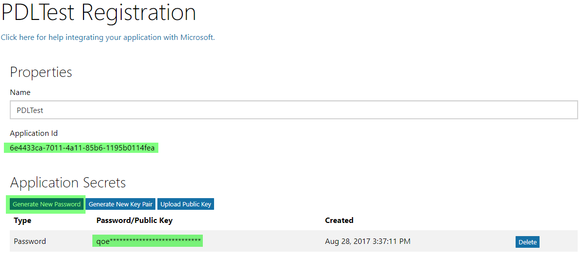
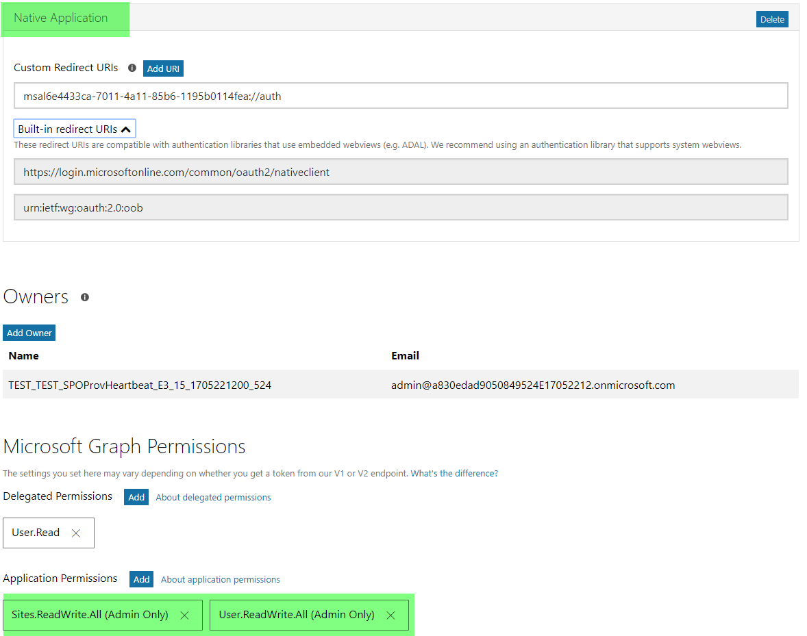
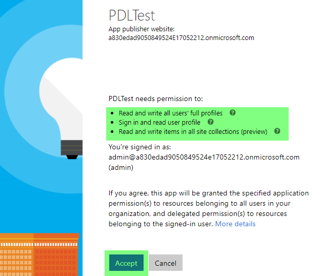
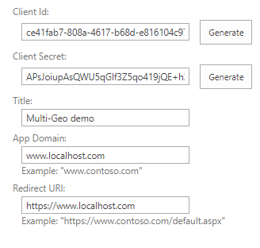
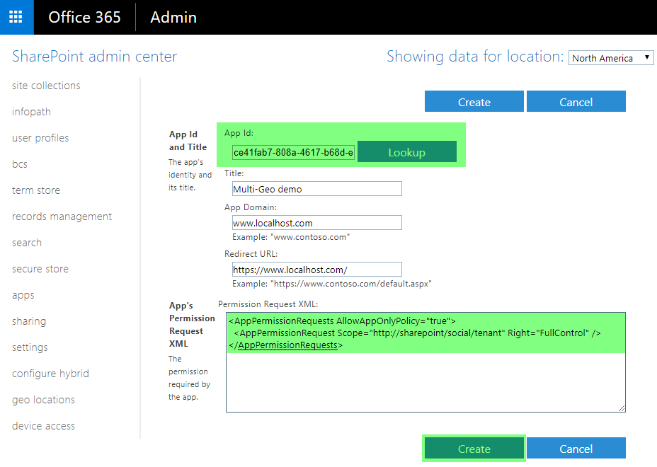
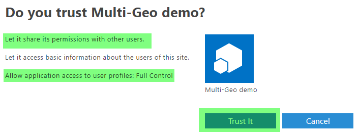

# Set up your Multi-Geo sample applications

> **Important:** OneDrive and SharePoint Online Multi-Geo is currently in preview and is subject to change.

When developing for a Multi-Geo tenant it's important to understand the security model and luckily the used model for a Multi-Geo tenant does not differ from the model used for a regular tenant. This article shows you how to configure the sample applications.

## My application needs to be able to read/update profiles for all users
### I'm using the Microsoft Graph API
As explained in the [Multi-geo User Profile Experience](multigeo-userprofileexperience.md) article the preferred model to read/update user profile properties is by using the Graph API. This chapter explains which permissions you'll need to grant to your application to realize tenant wide user profile reads and updates. There [a long list of possible permissions](https://developer.microsoft.com/en-us/graph/docs/concepts/permissions_reference) that you can grant to an application defined in Azure AD, but for manipulating profiles you can limit permissions to:

|**Permission**|**Type**|**Description**| **Admin consent needed**
|:-----|:-----|:-----|:-----|
|**[User.ReadWrite.All](https://developer.microsoft.com/en-us/graph/docs/concepts/permissions_reference#user-permissions)** | Application permission | Allows the app to read and write the full set of profile properties, group membership, reports and managers of other users in your organization, without a signed-in user.  Also allows the app to create and delete non-administrative users. Does not allow reset of user passwords. | Yes
|**[Sites.ReadWrite.All](https://developer.microsoft.com/en-us/graph/docs/concepts/permissions_reference#user-permissions)** | Application permission | Allows the app to read/write documents and list items in all site collections without a signed in user. This permission is only needed if the application will be retrieving the user's personal site location (e.g. https://graph.microsoft.com/v1.0/users/UserB@contoso.onmicrosoft.com?$select=mySite) | Yes

The Microsoft Graph based Multi-Geo samples are using the Microsoft Authentication Library (MSAL) to connect with the Microsoft Graph on the v2 endpoint. Compared to ADAL which connects using the v1 endpoint, MSAL allows connection to the Microsoft Graph with Microsoft Accounts, Azure AD and Azure AD B2C. Below instructions will help you setup your application for the v2 endpoint, but you can also use the "older" approach based on the v1 endpoints.

#### Register your application
To use application permissions against the Microsoft Graph you first have to register your application. You do this at https://apps.dev.microsoft.com. Once logged in click add a new Converged application, by clicking Add an app



Give your application a name and hit Create application.

In the application configuration screen configure the following:
- Generate a password and make a note of it together with the application id
- Click 'Add Platform' and select "Native application" as the platform target as the application does not have a landing page
- Add the necessary Application Permission. In this sample app we have added the User.ReadWrite.All and Sites.ReadWrite.All application permissions.
- Make sure to uncheck 'Live SDK support'
- Once configured save your changes.




#### Consent to the application
In this sample the User.ReadWrite.All and Sites.ReadWrite.All application permissions require admin consent in a tenant before it can be used. Create a consent URL like the following:

```
https://login.microsoftonline.com/<tenant>/adminconsent?client_id=<clientid>&state=<something>
```

Using the client id from the app registered and consenting to the app from my tenant contoso.onmicrosoft.com, the URL looks like this:

```
https://login.microsoftonline.com/contoso.onmicrosoft.com/adminconsent?client_id=6e4433ca-7011-4a11-85b6-1195b0114fea&state=12345
```

Browsing to the created URL and log in as a tenant admin, and consent to the application. You can see the consent screen show the name of your application as well as the permission scopes you configured.



### I'm using the CSOM User Profile API
When using the CSOM API to manipulate profile properties you'll only do this for the custom created properties since out-of-the-box properties are better handled via the Microsoft Graph API...see the [Multi-geo User Profile Experience](multigeo-userprofileexperience.md) article for more details. From a permission point of view there's two modes:

#### Using user credentials
This requires setting up a `ClientContext` object using the tenant admin url and using SharePoint Online admin credentials. Since there's only one Azure AD instance holding users this also implies that a SharePoint Online admin is admin for all the geo locations.

```C#
string tenantAdminSiteForMyGeoLocation = "https://contoso-europe-admin.sharepoint.com";

using (ClientContext cc = new ClientContext(tenantAdminSiteForMyGeoLocation))
{
    SecureString securePassword = GetSecurePassword("password");
    cc.Credentials = new SharePointOnlineCredentials("admin@contoso.onmicrosoft.com", securePassword);
    
    // user profile logic
}

static SecureString GetSecurePassword(string Password)
{
    SecureString sPassword = new SecureString();
    foreach (char c in Password.ToCharArray()) sPassword.AppendChar(c);
    return sPassword;
}
```

#### Using an app-only principal
When using app-only you'll need to grant the created app principal **full control** for the [http://sharepoint/social/tenant](https://dev.office.com/sharepoint/docs/general-development/get-started-developing-with-social-features-in-sharepoint#bkmk_AppPerms) permission scope. Below instructions show you to use appregnew.aspx and appinv.aspx to register an app principal and consent it.

##### Create the principal
Navigate to a site in your tenant (e.g. https://contoso.sharepoint.com) and then call the appregnew.aspx page (e.g. https://contoso.sharepoint.com/_layouts/15/appregnew.aspx). In this page click on the Generate button to generate a client id and client secret and fill the remaining information like shown in the screen-shot below.



> **Important**
> Store the retrieved information (client id and client secret) since you'll need this in the next step!

##### Grant permissions to the created principal
Next step is granting permissions to the newly created principal. Since we're granting tenant scoped permissions this granting can only be done via the appinv.aspx page on the tenant administration site. You can reach this site via https://contoso-admin.sharepoint.com/_layouts/15/appinv.aspx. Once the page is loaded add your client id and look up the created principal:



In order to grant permissions you'll need to provide the permission XML that describes the needed permissions. Since the UI experience scanner needs to be able to access all sites + also uses search with app-only it requires below permissions:

```Xml
<AppPermissionRequests AllowAppOnlyPolicy="true">
  <AppPermissionRequest Scope="http://sharepoint/social/tenant" Right="FullControl" />
</AppPermissionRequests>
```

When you click on Create you'll be presented with a permission consent dialog. Press Trust It to grant the permissions:




##### Use the principal in your code
Once the principal is created and consented you can use the principal's id and secret to request an access. The `TokenHelper.cs` class will grab the id and secret from the application's configuration file.

```C#
string tenantAdminSiteForMyGeoLocation = "https://contoso-europe-admin.sharepoint.com";

//Get the realm for the URL
string realm = TokenHelper.GetRealmFromTargetUrl(siteUri);

//Get the access token for the URL.  
string accessToken = TokenHelper.GetAppOnlyAccessToken(TokenHelper.SharePointPrincipal, siteUri.Authority, realm).AccessToken;

//Create a client context object based on the retrieved access token
using (ClientContext cc = TokenHelper.GetClientContextWithAccessToken(tenantAdminSiteForMyGeoLocation, accessToken))
{
    // user profile logic
}
```

A sample app.config looks like this:

```XML
<?xml version="1.0" encoding="utf-8"?>
<configuration>
  <appSettings>
    <!-- Use AppRegNew.aspx and AppInv.aspx to register client id with proper secret -->
    <add key="ClientId" value="[Your Client ID]" />
    <add key="ClientSecret" value="[Your Client Secret]" />
  </appSettings>
</configuration>
```


> [!NOTE] 
> You can easily insert the `TokenHelper.cs` class in your project by adding the **AppForSharePointOnlineWebToolkit** nuget package to your solution.

## My application needs to be able to be able to discover the Multi-Geo configuration
### I'm using the Microsoft Graph API
The only supported API discover the geo locations in a Multi-Geo tenant is by using the Graph API. This chapter explains which permissions you'll need to grant to your application to discover Multi-Geo information. There [a long list of possible permissions](https://developer.microsoft.com/en-us/graph/docs/concepts/permissions_reference) that you can grant to an application defined in Azure AD, but for reading Multi-Geo tenant configuration information you can limit permissions to:

|**Permission**|**Type**|**Description**| **Admin consent needed**
|:-----|:-----|:-----|:-----|
|**[Sites.ReadWrite.All](https://developer.microsoft.com/en-us/graph/docs/concepts/permissions_reference#user-permissions)** | Application permission | Allows the app to read/write documents and list items in all site collections without a signed in user. | Yes

Use the Azure AD application creation steps as described in the "My application needs to be able to read/update profiles for all users" chapter.

## My application needs to be able to create/delete sites collections or set tenant site collection properties
### I'm using the Microsoft Graph API
The [Multi-Geo Sites](multigeo-sites.md) provides more details on how to create group sites (a.k.a. "modern" team sites) using the Microsoft Graph API, in this section we're only addressing the permissions. Below table lists the needed permissions

|**Permission**|**Type**|**Description**| **Admin consent needed**
|:-----|:-----|:-----|:-----|
|**[Group.ReadWrite.All](https://developer.microsoft.com/en-us/graph/docs/concepts/permissions_reference#group-permissions)** | Application permission | Allows the app to create groups, read and update group memberships, and delete groups. All of these operations can be performed by the app without a signed-in user. Note that not all group API supports access using app-only permissions. | Yes

The Microsoft Graph based Multi-Geo samples are using the Microsoft Authentication Library (MSAL) to connect with the Microsoft Graph on the v2 endpoint. Compared to ADAL which connects using the v1 endpoint, MSAL allows connection to the Microsoft Graph with Microsoft Accounts, Azure AD and Azure AD B2C. Use the Azure AD application creation steps as described in the "My application needs to be able to read/update profiles for all users" chapter.

### I'm using the CSOM Tenant API
Using the CSOM Tenant API is very similar to the previously described CSOM guidance, in a matter of fact the guidance for using user credentials is identical. For using an app-only principal the instructions are the same but you'll need to grant different permissions (tenant, full control):

```Xml
<AppPermissionRequests AllowAppOnlyPolicy="true">
  <AppPermissionRequest Scope="http://sharepoint/content/tenant" Right="FullControl" />
</AppPermissionRequests>
```

## Resources
Below list of resources are useful when you're learning more about the Microsoft Graph API and CSOM API's:
- [Microsoft Graph developer center](https://developer.microsoft.com/en-us/graph)
- [Get access tokens to call the Graph API](https://developer.microsoft.com/en-us/graph/docs/concepts/auth_overview)
- [Microsoft Graph documentation](https://developer.microsoft.com/en-us/graph/docs/concepts/overview)
- [Graph Explorer](https://developer.microsoft.com/en-us/graph/graph-explorer)
- [App-only and elevated privileges in the SharePoint add-in model](app-only-elevated-privileges-sharepoint-add-in.md)
